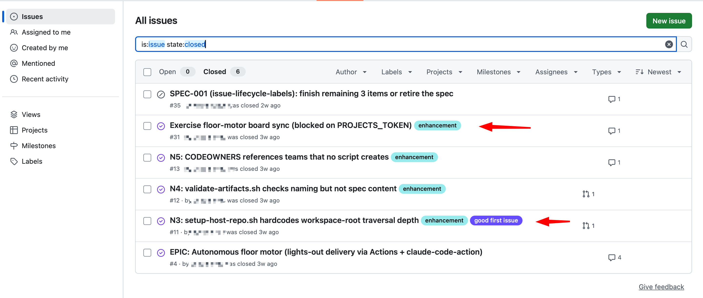
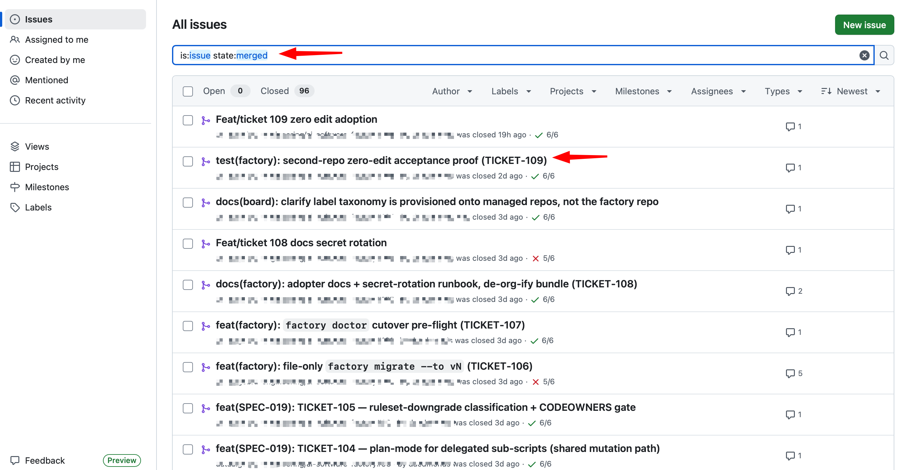

<p align="center">
    

</p>

<p align="center">
  <strong>Build with one AI. Verify with another. Merge with confidence.</strong>
</p>


📅 <a href="https://calendar.google.com/calendar/u/0/appointments/schedules/AcZssZ0jW4tXS9oprMT773HT843ndiFdPXAK7pro0FhX3mCpVWyYE0Y0adsAe-cPVrVSqrQ0Bm2n4cPS"> Book a Meeting</a>
<br>

------------------------------------------------------------------------

## What is AI Software Factory Floor?

AI Software Factory Floor is an **opinionated, GitHub-native software
delivery framework** that enforces a **spec-first Software Development
Lifecycle (SDLC)** using AI.

Rather than treating AI as a coding assistant, this project treats
software delivery like a production line:

-   **Claude** (or your preferred implementation model) writes the
    software.
-   **An independent AI model** audits the implementation using
    different prompts, reasoning, and evaluation criteria.
-   **GitHub quality gates** enforce every delivery stage.
-   **Humans make the final merge decision.**

> **Independent implementation + independent verification = better
> software.**

------------------------------------------------------------------------

# Why this project exists

Modern coding agents are excellent at writing code.

Production software requires much more than code generation:

-   Product specifications
-   Architecture reviews
-   Security reviews
-   Test planning
-   Verification
-   Documentation
-   Human approval

Most AI workflows rely on convention.

AI Software Factory Floor turns these engineering practices into
**machine-enforced GitHub gates** so quality becomes part of the
delivery pipeline---not an afterthought.

<p align="center">
    

</p>

------------------------------------------------------------------------

<p align="center">
    

</p>

------------------------------------------------------------------------

# How it Works

``` text
Idea
   │
   ▼
Product Specification
   │
   ▼
Architecture & Security Review
   │
   ▼
Implementation
   │
   │  Claude (or your preferred coding model)
   ▼
Verification & Audit
   │
   │  Independent AI model
   ▼
GitHub Quality Gates
   │
   ▼
Human Approval
   │
   ▼
Merge
```

------------------------------------------------------------------------

# Core Principles

-   📋 Specification before implementation
-   🤖 Independent implementation and verification
-   🚦 Machine-enforced quality gates
-   👤 Humans approve every merge
-   📚 Every engineering decision is traceable

------------------------------------------------------------------------

# Open Source Features

## Spec-First SDLC

-   14-phase delivery methodology
-   Product specification templates
-   Acceptance criteria
-   Verification reports

## GitHub Enforcement

-   Branch rulesets
-   CODEOWNERS
-   Required status checks
-   Issue templates
-   Pull request templates
-   Labels
-   Project board configuration

## AI Role Definitions

-   Product Manager
-   Architect
-   Security
-   Backend
-   Frontend
-   QA
-   Documentation
-   Additional Claude Code role subagents

## Automation

Provisioning scripts for:

-   Labels
-   Rulesets
-   Project boards
-   Repository configuration

------------------------------------------------------------------------

# Repository Layout

  Path                   Description
  ---------------------- ----------------------------------------------------
  `.claude/agents/`      Claude Code role subagents
  `.claude/commands/`    Public utility commands
  `agents/`              Human-readable role definitions
  `workflows/`           SDLC workflow documentation
  `templates/`           Specifications, tickets and verification templates
  `templates/factory/`   GitHub enforcement configuration
  `docs/`                Architecture and implementation guides
  `scripts/`             Repository provisioning
  `knowledge/`           Reference material

------------------------------------------------------------------------

# Engineering Invariants

-   No implementation before an approved specification.
-   One ticket equals one independently shippable slice.
-   Every acceptance criterion requires verification.
-   AI may open pull requests.
-   AI never approves its own work.
-   Humans merge code.

------------------------------------------------------------------------

# Quick Start

``` bash
./scripts/setup-repo.sh your-org/your-repo
```

``` bash
cat docs/architecture/ai-software-factory.md
```

``` bash
cat templates/factory/README.md
```

------------------------------------------------------------------------

# Open Source vs Commercial

  Open Source                    Commercial
  ------------------------------ -------------------------------
  14-phase SDLC                  End-to-end orchestration
  GitHub quality gates           Autonomous delivery motor
  Claude Code role definitions   Multi-model orchestration
  Repository provisioning        Independent AI audit pipeline
  Documentation & templates      Enterprise deployment tooling

------------------------------------------------------------------------

# Philosophy

The innovation is **not** that AI writes code.

The innovation is separating software delivery into independent
responsibilities:

-   One AI implements.
-   One AI independently verifies.
-   GitHub enforces quality gates.
-   Humans approve production changes.

------------------------------------------------------------------------

# License

MIT

------------------------------------------------------------------------

# Commercial Edition

Interested in the complete AI Software Factory?

-   **Website:** https://burnsideproject.ai
-   **Email:** hello@burnsideproject.ai
-   **Book a Meeting:**
    https://calendar.google.com/calendar/u/0/appointments/schedules/AcZssZ0jW4tXS9oprMT773HT843ndiFdPXAK7pro0FhX3mCpVWyYE0Y0adsAe-cPVrVSqrQ0Bm2n4cPS
