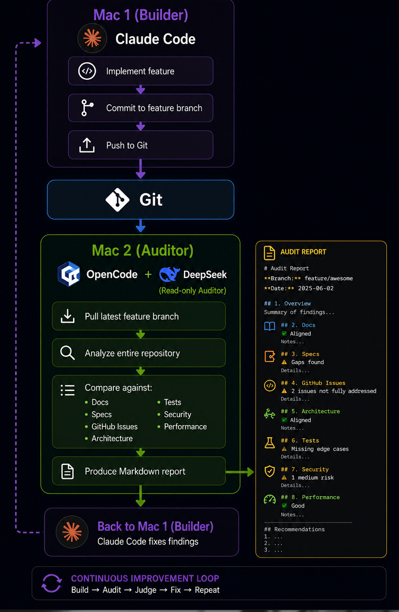

# ai-software-factory

<p align="center">
    
</p>
<br>

    <a href="https://calendar.google.com/calendar/u/0/appointments/schedules/AcZssZ0jW4tXS9oprMT773HT843ndiFdPXAK7pro0FhX3mCpVWyYE0Y0adsAe-cPVrVSqrQ0Bm2n4cPS"> Book a Meeting</a>

An opinionated, spec-first AI SDLC for delivering software with Claude Code —
plus the GitHub-native gates that make each stage enforced, not just convention.

It encodes a 12-phase delivery flow — idea → spec → architecture & security review
→ agile tickets → test plan → **spec gate** → implementation → verification →
docs → PR → **compliance gate** → human-approved merge — as a set of
single-responsibility subagents and slash commands you drop into any project.

## What's in here

| Path | What it is |
|---|---|
| `.claude/agents/` | 12 native Claude Code subagents (one per role), with scoped tools |
| `.claude/commands/` | `/feature-delivery` (full flow) and `/post-merge` (archive) |
| `agents/`, `workflows/` | Human-readable source-of-truth role cards and workflow |
| `templates/` | Spec, ticket, and verification-report templates |
| `skills/agile-spec-builder.md` | Idea → thin spec → small slices, with a gate |
| `prompts/` | Intake / feature-request prompt |
| `templates/factory/` | **GitHub enforcement layer** — CODEOWNERS, issue + PR templates, rulesets (per-repo + naming), CI/verify gates, Project + sync + audit + **metrics** scripts. See `templates/factory/README.md`, `NAMING.md`, `METRICS.md` |
| `docs/architecture/ai-software-factory.md` | The factory model: SDLC line → enforced gate mapping |
| `VERSION` | Method version; pinned into each project as `.ai/METHOD_VERSION` |
| `scripts/bootstrap-project.sh` | Install the system into a new project (stamps version, validates name) |
| `scripts/upgrade-project.sh` | Re-sync the method into an existing project + bump its `METHOD_VERSION` |
| `RUNBOOK-claude-code.md` | **Start here** — how to operate the native flow |
| `runbook.md` | The original prose process (same 12 phases) |

## Quick start

```bash
./scripts/bootstrap-project.sh /path/to/new-project
cd /path/to/new-project
# in Claude Code:
/feature-delivery <your feature idea>
```

See **[RUNBOOK-claude-code.md](RUNBOOK-claude-code.md)** for the full operator guide.

## Gated delivery (GitHub enforcement)

The agents produce artifacts; `templates/factory/` makes each SDLC stage a
machine-enforced gate when the project is wired to GitHub:

- **Test/Verify/Review** — required CI checks + CODEOWNERS approvals (`ruleset.*.json`, reconciled per repo)
- **Naming** — branch/PR/commit + spec/ticket ID + repo-name conventions (`ruleset.naming.json`, `pr-lint.yml`, `validate-artifacts.sh`, `audit-org-naming.sh`); see `templates/factory/NAMING.md`
- **Tracking** — Epic/Task issue templates + org Project, synced from artifact front-matter (`setup-project.sh`, `sync-issues.sh`)
- **PR background** — every PR links the full background (spec + epic + all related tickets/issues) via `PULL_REQUEST_TEMPLATE.md`, filled by the release-engineer and checked by the compliance-reviewer
- **Metrics** — WIP / throughput / cycle time read from the org Project (`scripts/metrics.sh`); see `templates/factory/METRICS.md`

Operate it via `templates/factory/ROLLOUT.md`. The greenfield `ci.yml`/`deploy.yml`
are for new repos; existing repos keep their CI and get a reconciled ruleset.

## Versioning

`VERSION` is the method version. `bootstrap-project.sh` pins it into a project as
`.ai/METHOD_VERSION`; `upgrade-project.sh` re-syncs the method and bumps that pin —
so projects adopt method updates intentionally instead of drifting.

## Core invariants

- No code before an accepted spec and a `Ready` spec gate.
- One ticket = one shippable slice; no unrelated refactors.
- Every acceptance criterion has recorded test evidence.
- Agents open PRs; **humans merge.**
- Gates are checks; **no agent approves its own gate.**
