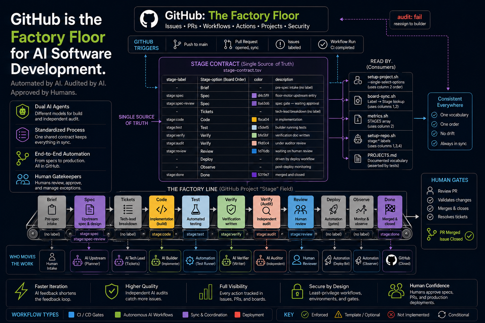

# ai-software-factory-floor


<p align="center">
    
</p>
<br>

An autonomous floor motor variant of the AI-First Software Factory — an opinionated, spec-first AI SDLC for delivering software with Claude Code, enhanced with GitHub-native gates that make each stage enforced, not just convention.

[📅 Book a Meeting](https://calendar.google.com/calendar/u/0/appointments/schedules/AcZssZ0jW4tXS9oprMT773HT843ndiFdPXAK7pro0FhX3mCpVWyYE0Y0adsAe-cPVrVSqrQ0Bm2n4cPS)

This floor-motor variant adds **autonomous delivery capability**: the system can operate end-to-end without human intervention, using independent AI auditors (GPT-5.5, DeepSeek V4, Gemini, Kimi, Qwen, or any reasoning model) to challenge the builder's work before human merge approval.

> **New here?** Start with **[templates/factory/QUICK-REFERENCE.md](templates/factory/QUICK-REFERENCE.md)** for a cheat sheet, then **[templates/factory/TEMPLATE-PACK.md](templates/factory/TEMPLATE-PACK.md)** for the complete template pack system, and finally **[OVERVIEW.md](OVERVIEW.md)** for a one-page map of the whole system.

## What's in here

| Path | What it is |
|---|---|
| `.claude/agents/` | 14 native Claude Code subagents (one per role), with scoped tools |
| `.claude/commands/` | **Delivery** (shipped into delivered projects): `/feature-delivery` (full flow), `/post-merge` (archive). **Provisioning** (factory-root only, in `.claude/commands/provisioning/`, filtered out of delivered projects — ADR-0004): `/provisioning:onboard-project` (guided provisioning walkthrough), `/provisioning:check-readiness` (onboarding pre-flight), `/provisioning:activate-gates` (guided gate-activation for an already-bootstrapped repo), `/provisioning:onboard-repo` (guided existing-repo / Path B onboarding) |
| `agents/`, `workflows/` | Human-readable source-of-truth role cards and workflow |
| `templates/` | Spec, ticket, and verification-report templates |
| `skills/agile-spec-builder.md` | Idea → thin spec → small slices, with a gate |
| `prompts/` | Intake / feature-request prompt |
| `templates/factory/` | **GitHub enforcement layer** — CODEOWNERS, issue + PR templates, rulesets (per-repo + naming), CI/verify gates, Project + sync + audit + **metrics** scripts. See `templates/factory/README.md`, `NAMING.md`, `METRICS.md` |
| `docs/architecture/ai-software-factory.md` | The factory model: SDLC line → enforced gate mapping |
| `VERSION` | Method version; pinned into each project as `.ai/METHOD_VERSION` |
| `scripts/bootstrap-project.sh` | Install the system into a new project (stamps version, validates name). Also seeds the factory's `.github/` issue + PR templates and root `CODEOWNERS` (conventions only — **not** workflows). Fails hard if the `.claude/` native layer is missing; `--github-only` opts into a GitHub-enforcement-only install that skips that layer. `--target-existing <dir>` is the non-clobbering existing-repo (Path B) mode: it always refreshes the factory-owned `.ai/` + filtered `.claude/`, but preserves an existing repo's `CODEOWNERS`/knowledge/`Makefile`/lifecycle artifacts byte-for-byte (copy-if-absent), and is idempotent — see ADR-0005 |
| `scripts/upgrade-project.sh` | Re-sync the method into an existing project + bump its `METHOD_VERSION` |
| `scripts/factory-setup.sh` | **Template pack setup** — single command to create all labels (30+), Project board, Discussion categories, and milestones (v0.4.0, v0.5.0) |
| `scripts/label-setup.sh` | Create all labels (30+ labels for workflow stages, gates, priorities, types, status, scope) |
| `scripts/project-setup.sh` | Create Project board (AI Factory Delivery Pipeline) |
| `scripts/discussion-setup.sh` | Create Discussion categories (General, Ideas, Announcements, Feedback) |
| `scripts/milestone-setup.sh` | Create milestones (v0.4.0, v0.5.0) |
| `scripts/reconcile-ci-checks.sh` | Emit-and-review CI-check reconciliation: reads a repo's real CI check names (live read-only `gh api`, or an explicit `--checks` list) and emits a ruleset variant whose required checks match them, so flipping to `active` actually gates. Emits a reviewable file only — never POSTs; the operator applies it via `setup-repo.sh RULESET=<path>` |
| `templates/factory/scripts/setup-repo.sh` | Apply factory gating to one repo (labels, ruleset, environments). Ruleset selection is data-driven via `templates/factory/ruleset-map.tsv` (repo basename → variant; precedence `RULESET=` override > manifest > greenfield `ruleset.json`) — replaces the old hard-coded switch (ADR-0006). Opt-in `--stage-files` (default OFF) auto-opens a governance PR: it clones the repo, copies the governance subset (`CODEOWNERS`, issue/PR templates) **copy-if-absent** (never workflows), and **opens** a PR — open-only (never merges/approves/force-pushes), best-effort (ADR-0007) |
| `templates/factory/ruleset-map.tsv` | Data-driven ruleset manifest (TAB-separated: repo basename → ruleset variant file) read by `setup-repo.sh` — add a tailored-ruleset repo by adding a line, no code edit (ADR-0006) |
| `scripts/check-readiness.sh` | Read-only pre-flight check (`gh`, `jq`, `gh` scopes, `.claude/` layer). Run as step 0 of onboarding; exits non-zero with `MISSING:` lines if a prerequisite is absent |
| `PROVISIONING.md` | **Onboarding entry point** — the single canonical zero-to-operating runbook (greenfield + existing repos, per-org vs per-repo, "Am I done?" checklist) |
| `RUNBOOK-claude-code.md` | **Start here** — how to operate the native flow |
| `runbook.md` | The original prose process (outdated - use OVERVIEW.md or docs/getting-started.md for the 14-phase flow) |
| `templates/factory/TEMPLATE-PACK.md` | **Template pack system** — structured issue templates, 30+ labels, Project board, Discussion categories, automated workflows |
| `templates/factory/QUICK-REFERENCE.md` | **Quick reference** — operator cheat sheet for templates, labels, and workflows |
| `templates/factory/RUNBOOK-floor-motor.md` | **Floor motor autonomy** — autonomous delivery configuration and operation |

## Quick start

**[PROVISIONING.md](PROVISIONING.md) is the single canonical onboarding runbook** — it takes
a new or existing repo from prerequisites (`scripts/check-readiness.sh`) through the GitHub
enforcement layer to a gated, delivering instance, with an "Am I done?" checklist. Start there.

New to the command-line flow? **[docs/getting-started.md](docs/getting-started.md)** is a
task-oriented, copy-paste walkthrough with a track for each use case — a **new empty-shell
repo** and an **existing repo** — that links back to `PROVISIONING.md` for the deep detail.

For the template pack system (structured issue templates, labels, Project board, Discussion categories), see **[templates/factory/TEMPLATE-PACK.md](templates/factory/TEMPLATE-PACK.md)**.

The minimal first move (the full flow, including the enforcement steps between bootstrap and
first feature, is in `PROVISIONING.md`):

```bash
./scripts/bootstrap-project.sh /path/to/new-project
cd /path/to/new-project
# in Claude Code:
/feature-delivery <your feature idea>
```

See **[PROVISIONING.md](PROVISIONING.md)** for end-to-end onboarding and
**[RUNBOOK-claude-code.md](RUNBOOK-claude-code.md)** for the day-to-day operator guide.

## Floor motor autonomy

This floor-motor variant adds **autonomous delivery capability**:

- **Independent auditor** — DeepSeek V4, GPT-5.5, or other reasoning model runs independent tests and challenges the builder's work
- **Unattended operation** — `--permission-mode bypassPermissions` flag enables headless, non-interactive agent runs
- **Automated gates** — All stages enforced by GitHub checks; no manual intervention required
- **Self-healing** — `automate.sh` script orchestrates audit → plan features → implement → deploy cycle

Configure autonomy via `templates/factory/RUNBOOK-floor-motor.md`. The floor motor is optional — disable by removing autonomy flags for human-in-the-loop operation.

## Gated delivery (GitHub enforcement)

The agents produce artifacts; `templates/factory/` makes each SDLC stage a
machine-enforced gate when the project is wired to GitHub:

- **Test/Verify/Review** — required CI checks + CODEOWNERS approvals (`ruleset.*.json`, reconciled per repo)
- **Naming** — branch/PR/commit + spec/ticket ID + repo-name conventions (`ruleset.naming.json`, `pr-lint.yml`, `validate-artifacts.sh`, `audit-org-naming.sh`); see `templates/factory/NAMING.md`
- **Tracking** — Epic/Task issue templates + org Project, synced from artifact front-matter (`setup-project.sh`, `sync-issues.sh`)
- **PR background** — every PR links the full background (spec + epic + all related tickets/issues) via `PULL_REQUEST_TEMPLATE.md`, filled by the release-engineer and checked by the compliance-reviewer
- **Metrics** — WIP / throughput / cycle time read from the org Project (`scripts/metrics.sh`, plus an optional read-only weekly `.github/workflows/metrics.yml` for the host repo); see `templates/factory/METRICS.md`

Go live with `templates/factory/ACTIVATE.md` (general checklist — teams, the GitHub
App builder, and the `evaluate → active` flip) or `ROLLOUT.md` (the SPEC-005 pilot
instance). The greenfield `ci.yml`/`deploy.yml` are for new repos; existing repos keep
their CI and get a reconciled ruleset.

> **Activation is a deliberate second step.** `setup-repo.sh` applies rulesets in
> `evaluate` (report-only) mode so onboarding never blocks an in-flight PR — they
> do **not** block merges until flipped to `active` (re-run with `ENFORCEMENT=active`
> or flip in repo settings once CI is green). Likewise the `production` environment
> is created without a required reviewer; add one under
> Settings ▸ Environments ▸ production before relying on the deploy gate. `setup-repo.sh`
> prints both reminders on every run.

## Versioning

`VERSION` is the method version. `bootstrap-project.sh` pins it into a project as
`.ai/METHOD_VERSION`; `upgrade-project.sh` re-syncs the method and bumps that pin —
so projects adopt method updates intentionally instead of drifting.

## Core invariants

- No code before an accepted spec and a `Ready` spec gate.
- One ticket = one shippable slice; no unrelated refactors.
- Every acceptance criterion has recorded test evidence.
- Agents open PRs; **humans merge.**
- Gates are checks; **no agent approves its own gate.**

## Delivery status

The factory dogfoods itself. Current status of its own specs (source of truth:
[`docs/delivery-ledger.md`](docs/delivery-ledger.md); machine-readable in
[`knowledge/features.yaml`](knowledge/features.yaml)):

| Spec | Status | Ref |
|---|---|---|
| SPEC-000 · factory-audit | ✅ Completed | [#9](https://github.com/dataalgebra-engineering/ai-software-factory/pull/9), [#10](https://github.com/dataalgebra-engineering/ai-software-factory/pull/10) |
| SPEC-001 · issue-lifecycle-labels | ⛔ Retired (superseded) | [#35](https://github.com/dataalgebra-engineering/ai-software-factory/issues/35) |
| SPEC-002 · factory-dogfood-fixes | ✅ Completed | [#34](https://github.com/dataalgebra-engineering/ai-software-factory/pull/34) |

Also delivered, tracked by ADR/EPIC rather than a SPEC id (see the ledger): the gate
identity model (ADR-0001, #14), the autonomous floor motor (ADR-0002, #19–#23), and its
live validation (#28–#32, v0.3.1). Completed specs live in `specs/completed/`; SPEC-001 was
retired because its concrete goals were met by other work (labels on `main`, the `factory`
pr-lint type via SPEC-000) and the remaining agent-side wiring was dropped.

## Key differences from standard ai-software-factory

| Aspect | ai-software-factory | ai-software-factory-floor |
|---|---|---|
| **Phases** | 14 | 14 |
| **Agents** | 14 | 14 |
| **Template pack** | ✅ Full system | ✅ Full system |
| **Floor motor autonomy** | Optional add-on | Native capability |
| **Unattended operation** | Requires manual setup | Pre-configured |
| **Automate.sh** | Not included | Included |
| **Permission bypass** | Manual configuration | Default for autonomy |

## Provisioning

See [`PROVISIONING.md`](PROVISIONING.md) for the complete onboarding runbook.

**Quick checklist:**
1. Run `./scripts/check-readiness.sh` — fix any missing prerequisites
2. Bootstrap: `./scripts/bootstrap-project.sh /path/to/new-project`
3. Provision GitHub gates: `templates/factory/scripts/setup-repo.sh <repo>`
4. Activate: Flip rulesets from `evaluate` to `active` per `templates/factory/ACTIVATE.md`
5. Enable floor motor (optional): Configure `automate.sh` per `templates/factory/RUNBOOK-floor-motor.md`

## Template pack system

The factory uses a structured template pack for consistent issue management:

- **Issue templates**: Feature, Bug, Task, Epic
- **Labels**: 30+ for workflow stages, gates, priorities, types, status, scope
- **Project board**: AI Factory Delivery Pipeline (Org-level)
- **Discussion categories**: General, Ideas, Announcements, Feedback
- **Workflows**: CI, deploy, sync-issues, metrics, board-sync

Provision with `scripts/factory-setup.sh` or use the guided `/provisioning:onboard-project` slash command.

## Next steps

- Read [`PROVISIONING.md`](PROVISIONING.md) for end-to-end onboarding
- Read [`RUNBOOK-claude-code.md`](RUNBOOK-claude-code.md) for day-to-day operation
- Read [`templates/factory/TEMPLATE-PACK.md`](templates/factory/TEMPLATE-PACK.md) for template pack details
- Read [`templates/factory/RUNBOOK-floor-motor.md`](templates/factory/RUNBOOK-floor-motor.md) for autonomous delivery configuration
